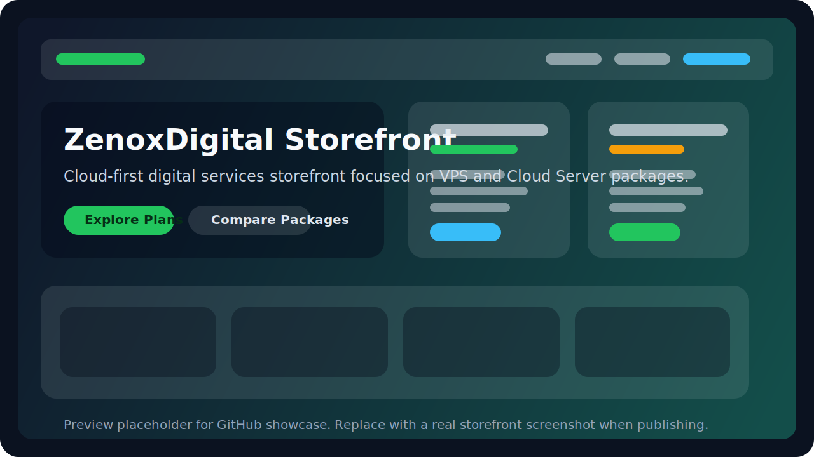
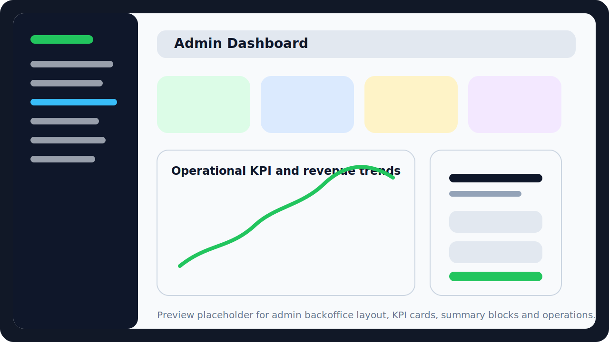
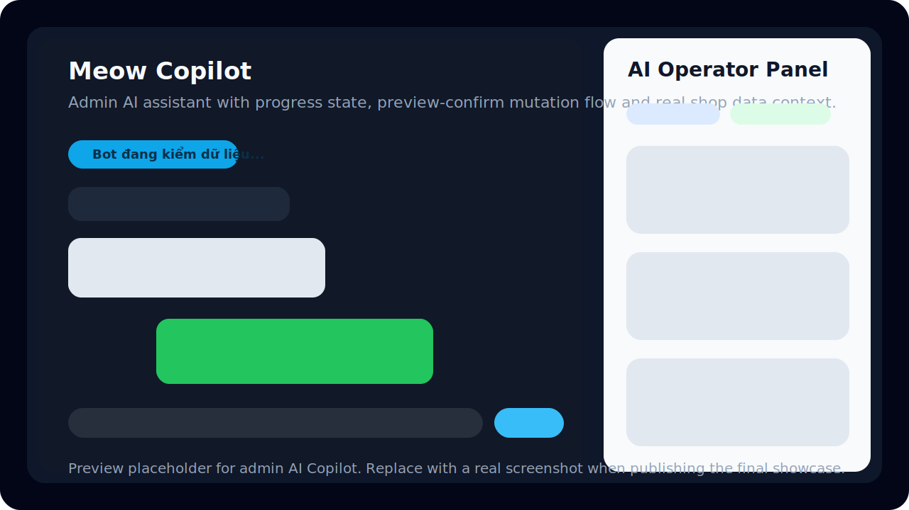
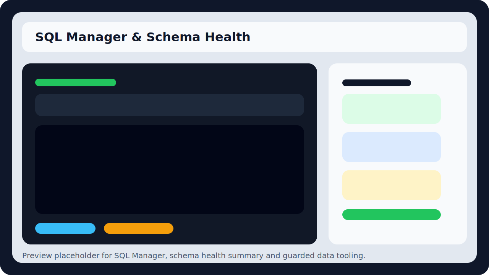

# ZenoxDigital


ZenoxDigital is a cloud-first digital services storefront and backoffice dashboard built with a custom PHP MVC stack. The project focuses on selling Cloud VPS / Cloud Server plans, managing operational workflows for digital products, and integrating AI assistance into both the public storefront and the admin dashboard.

This repository is prepared for three parallel purposes:

- academic reporting / capstone demonstration
- technical portfolio and CV showcase
- a public GitHub codebase that another developer can review and run locally

## Overview

ZenoxDigital models a digital commerce system with two main surfaces:

- a customer-facing storefront for browsing and purchasing digital service packages
- an admin dashboard for operating products, orders, users, coupons, payments, feedback, and AI-assisted workflows

The product direction is intentionally cloud-first: Cloud VPS and Cloud Server plans are the main catalog focus, while additional digital products such as game top-ups or wallet services support a broader marketplace scenario.

From a technical perspective, the project emphasizes:

- modular PHP MVC organization instead of controller-heavy procedural code
- business logic separation into Models and Services
- role-aware backoffice behavior
- AI that is constrained by permissions, session context, and available business data

## Problem Statement / Project Goal

Many student e-commerce projects stop at a simple catalog and checkout UI. ZenoxDigital was designed to go further by exploring how a digital services store can be modeled as an operational system, not only as a landing page.

The project goals are:

- build a storefront for digital service discovery and purchase flow
- model key commerce entities such as products, orders, users, coupons, wallet transactions, and feedback
- implement a usable admin dashboard with role-aware access and operational modules
- integrate AI as a support layer for customer guidance and backoffice assistance, without turning AI into an unrestricted write path
- practice system design concerns such as session management, 2FA, audit logging, rate limiting, SQL guardrails, and schema health checks

## Key Features

### Storefront

- Cloud-first homepage with featured cloud categories and product highlights
- product catalog with search, filtering, sorting, and pagination
- product detail pages with specs, related items, and checkout flow
- user authentication with email/password and Google OAuth
- user profile with wallet, order history, security center, sessions, and 2FA
- customer-facing AI widget for product guidance, FAQ support, feedback capture, and order/account help

### Admin Dashboard

- KPI-based dashboard with product, order, coupon, feedback, revenue, and user snapshots
- product, category, order, user, coupon, rank, feedback, payment, audit-log, and SQL Manager modules
- role-aware backoffice scope for `admin` and limited `staff`
- Meow Copilot panel embedded into the admin UI
- admin AI workflows for dashboard summary, operational queries, and guarded mutation previews

### AI / Meow Copilot

- customer chatbot for product guidance, FAQ, feedback, and basic order/account support
- admin copilot for dashboard summary, order status insight, coupon/product recommendations, and controlled backoffice actions
- server-side AI bridge integration with runtime metadata such as provider, source, mode, and fallback state
- mutation guardrail flow: `preview -> confirm -> execute -> audit`
- role-aware behavior: `guest`, `customer`, `admin`, `staff`

### Operations and Data Safety

- SQL Manager with import preflight, transaction-aware DML handling, and error reporting
- schema health checks and module health guards to isolate broken modules safely
- admin audit logging for backoffice actions and AI-assisted mutations
- rate limiting for login, profile-sensitive flows, and AI endpoints
- session tracking, backup codes, and 2FA flows for user security

## System Modules

The current codebase includes the following business modules:

- `Products`: digital service catalog, pricing, specs, media, and storefront presentation
- `Categories`: cloud-first grouping and storefront segmentation
- `Orders`: order lifecycle, status tracking, and dashboard statistics
- `Users`: authentication, profile, role assignment, status, and security data
- `Wallet Transactions`: deposit/spend history and wallet balance operations
- `Payments`: admin payment overview plus SePay webhook-based wallet top-up processing
- `Coupons`: campaign and discount management
- `Customer Feedback`: support and post-purchase feedback records
- `Rank Management`: configurable user rank thresholds and coupon-related incentives
- `Audit Logs`: traceability for admin-side actions
- `SQL Manager`: guarded SQL inspection and import tooling for administrators
- `AI Modules`: bridge, context builder, actor resolver, guardrails, session persistence, sales recommendations, and admin mutation orchestration

## Architecture / Project Structure

ZenoxDigital uses a custom PHP MVC structure with an explicit Service layer for business workflows.

```text
ZenoxDigital/
├─ app/
│  ├─ Controllers/       # storefront and admin controllers
│  ├─ Core/              # App, Controller, Auth, Database, Model, View
│  ├─ Models/            # PDO-backed data access
│  ├─ Services/          # AI, payments, schema health, SQL import, domain services
│  └─ Views/             # storefront, auth, profile, admin, partials, layouts
├─ config/               # routes, config, AI capability catalog
├─ database/             # schema and demo seed SQL
├─ docs/                 # AI design notes, screenshots, presentation notes
├─ public/
│  ├─ assets/            # CSS, JavaScript
│  ├─ images/
│  └─ uploads/
└─ storage/              # runtime storage and temporary artifacts
```

### Architectural Notes

- routing is handled by a lightweight custom dispatcher in [App.php](C:\xampp\htdocs\ZenoxDigital\app\Core\App.php)
- data access is built on PDO with prepared statements via [Database.php](C:\xampp\htdocs\ZenoxDigital\app\Core\Database.php)
- controllers coordinate flow, while business-heavy logic is pushed into Services where appropriate
- the admin side is not a separate application; it is a dedicated backoffice surface inside the same codebase
- AI integration is server-side and does not expose provider keys to the browser

## Tech Stack

| Layer | Technology |
|---|---|
| Backend | PHP 8.x, custom PHP MVC |
| Database | MySQL / MariaDB |
| Data access | PDO prepared statements |
| Frontend | HTML, Bootstrap 5, vanilla JavaScript |
| Authentication | Session-based auth, Google OAuth 2.0 |
| Security | CSRF, rate limiting, session tracking, 2FA, audit logging |
| AI integration | External AI bridge + local fallback strategy |
| Payment integration | SePay webhook for wallet top-up verification |

## AI / Meow Copilot

AI is a real subsystem in this project, but it is intentionally scoped and guarded.

### What is implemented today

- customer-side AI widget on the storefront
- admin-side Meow Copilot inside the dashboard
- AI session persistence for admin conversations
- actor resolution based on backend session/auth state
- AI context building from live shop data
- recommendation support for cloud-first products and coupons
- controlled admin mutations for selected modules with audit trail

### What is intentionally constrained

- AI does not have unrestricted SQL write access
- high-risk domains such as profit optimization and capacity analysis are not claimed as complete
- some admin modules remain read-only or preview-only under AI guardrails
- fallback exists as a technical safety mechanism, not as the intended primary runtime

### Current AI State

According to the implementation tracking in `docs/AI_IMPLEMENTATION_STATUS.md` and `docs/AI_FEATURE_PHASES_CHECKLIST.md`:

- Phase 0 to Phase 5 are implemented
- customer support chat, feedback capture, order/account help, admin copilot, and preliminary sales recommendations are present
- Phase 6 to Phase 8 remain future work because the current schema still lacks fields such as `cost_price`, `stock_qty`, `capacity_limit`, `capacity_used`, and `min_margin_percent`

This matters for public readers: the AI layer is meaningful and data-aware, but it is not being presented as a fully autonomous production-ready operations agent.

## Security / Access Control

ZenoxDigital includes several security and governance features that are relevant both academically and technically:

- session-based authentication with tracked login sessions
- optional Google OAuth login
- 2FA enable/disable/reset flow with backup codes
- role-aware permissions in [Auth.php](C:\xampp\htdocs\ZenoxDigital\app\Core\Auth.php)
- rate limiting for login, registration, password reset, profile-sensitive actions, and AI endpoints
- CSRF protection on state-changing requests
- admin audit logging for backoffice actions
- SQL Manager restricted to admin and backed by import/query safeguards
- schema health and module health guards to avoid cascading failures when a data module becomes unsafe

## Installation / Run Locally

### Requirements

- PHP 8.x
- MySQL or MariaDB
- Apache with `mod_rewrite`
- XAMPP, Laragon, or a similar local PHP stack
- optional: an AI bridge service if you want to enable Meow chatbot / Copilot runtime

### 1. Clone the repository

```bash
git clone https://github.com/EmBeHocCode/ZenoDigital.git
cd ZenoDigital
```

### 2. Create the environment file

Copy `.env.example` to `.env` and adjust the important values:

- `APP_URL`
- `DB_HOST`
- `DB_PORT`
- `DB_NAME`
- `DB_USER`
- `DB_PASS`
- `UPLOAD_PATH`

Do not commit real secrets or provider keys to a public repository.

### 3. Import the database

For a clean baseline:

- import [schema.sql](C:\xampp\htdocs\ZenoxDigital\database\schema.sql)

Optional:

- import [demo_dashboard_seed.sql](C:\xampp\htdocs\ZenoxDigital\database\demo_dashboard_seed.sql) if you want richer dashboard and reporting data for presentation/demo purposes

### 4. Configure AI bridge only if needed

Basic AI-related environment values:

```env
AI_ENABLED=true
AI_PROVIDER=bridge
AI_BRIDGE_URL=http://your-ai-bridge/api/web-chat
AI_BRIDGE_KEY=your-secret-key
AI_CHAT_TIMEOUT=20
AI_BRIDGE_RETRIES=1
AI_BRIDGE_ALLOW_LOCAL_FALLBACK=true
```

If you do not want to run AI locally yet, you can disable it:

```env
AI_ENABLED=false
```

### 5. Run the project locally

Point Apache to the `public` entry point, then open:

```text
http://localhost/ZenoxDigital/public
```

## Demo Flow / How to Use

### Storefront Demo Flow

1. Open the homepage and review the cloud-first positioning.
2. Browse the product catalog and filter Cloud VPS / Cloud Server plans.
3. Open a product detail page and inspect specs plus related plans.
4. Register or sign in to access profile, wallet, and security features.
5. Use the AI widget for product guidance or feedback submission.
6. Try checkout with wallet balance if your demo data is prepared for it.

### Admin Demo Flow

1. Sign in with an account that has backoffice access.
2. Open `/admin` to view KPI cards and dashboard charts.
3. Visit products, orders, users, coupons, feedback, payments, and SQL Manager.
4. Open Meow Copilot and ask operational questions such as:
   - pending orders summary
   - coupon status
   - top-selling products
   - quick cloud product recommendation
5. For AI-assisted mutations, observe the preview/confirm flow instead of direct free-form writes.

## Screenshots

The repository already includes lightweight placeholder preview images in [docs/screenshots](C:\xampp\htdocs\ZenoxDigital\docs\screenshots). These are useful for GitHub layout now and can be replaced with real captures later.

### Current screenshot assets

- 
- 
- 
- 

### Recommended real screenshots to add later

- homepage / hero with featured cloud products
- product catalog with filters
- product detail page
- admin dashboard overview
- Meow Copilot panel
- SQL Manager import/report screen

## What I Learned / Technical Highlights

This project is valuable as a learning and portfolio artifact because it demonstrates more than UI assembly.

### Engineering highlights

- designing a modular PHP MVC codebase without relying on a full framework
- organizing business logic into Controllers, Models, and Services
- implementing role-aware backoffice permissions for admin and staff scopes
- building profile security flows with session tracking and 2FA
- modeling business entities for a digital services commerce workflow
- adding AI as a constrained support layer rather than a disconnected chatbot demo
- using schema health and SQL guardrails to reduce administrative risk

### Academic value

- maps well to software engineering topics such as requirements analysis, system design, data modeling, and access control
- demonstrates how a commerce-oriented information system can be structured end to end
- provides a concrete example of integrating AI into an operational system with permissions and guardrails

### Portfolio / CV value

- shows end-to-end product thinking across storefront, admin dashboard, security, data, and AI
- demonstrates backoffice tooling, not only customer-facing pages
- highlights practical engineering tradeoffs: current state vs roadmap, guarded AI, and incomplete data domains
- fits well for backend PHP, full-stack web, internal tools, or product engineering roles

## Current Limitations

The following limitations are explicitly true in the current state of the repository:

- the project is local-first and demo-oriented; it is not presented as fully production-hardened
- there is no automated test suite or CI pipeline in the repository yet
- AI profit/capacity analysis is intentionally incomplete because the current schema does not yet include cost and capacity fields
- AI runtime depends on an external bridge service when enabled
- some operational modules are safer than others; a number of AI-admin actions remain preview-only or read-only by design
- environment setup currently assumes a traditional PHP hosting or XAMPP-style local environment rather than containerized deployment

## Roadmap

The roadmap below reflects the actual unfinished areas rather than marketing promises.

### Product and Backoffice

- continue polishing payment and wallet operational flows
- improve dashboard reporting depth and operational summaries
- refine storefront content and cloud-first merchandising strategy

### AI Roadmap

- Phase 6: slow-moving product and capacity analysis
- Phase 7: profit guardrails with cost-aware recommendation boundaries
- Phase 8: executive reporting and action-plan style outputs for admin

### Engineering Roadmap

- add automated tests for critical modules
- add static checks and CI for public-repo readiness
- improve deployment documentation for public contributors
- replace placeholder screenshots with real system captures

## License

This project is licensed under the MIT License. See [LICENSE](C:\xampp\htdocs\ZenoxDigital\LICENSE).
