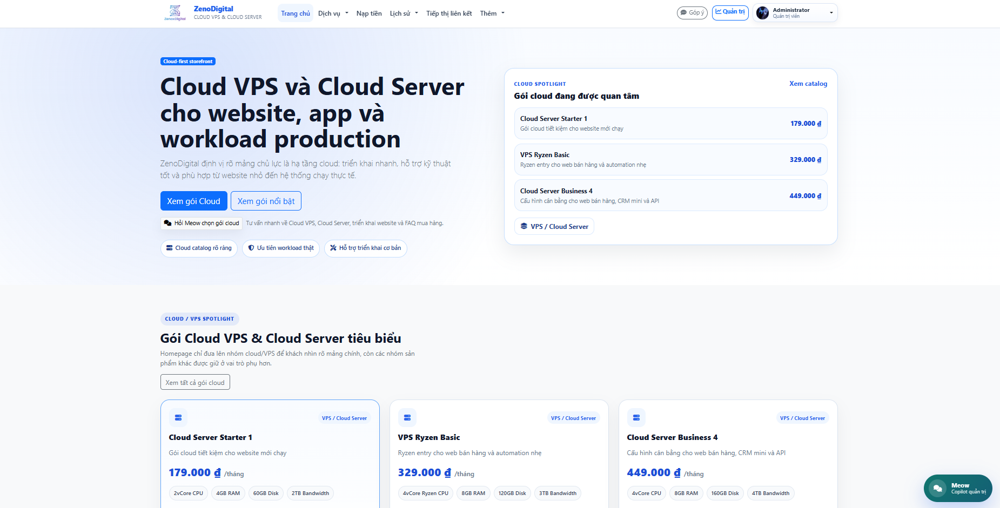
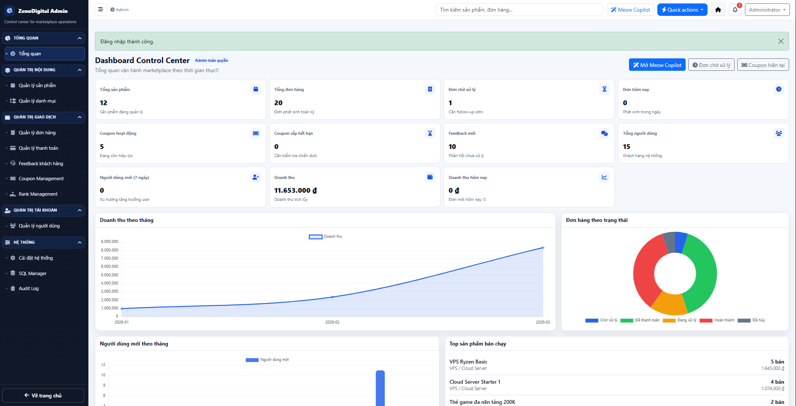
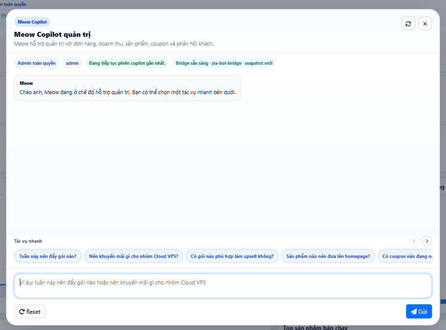
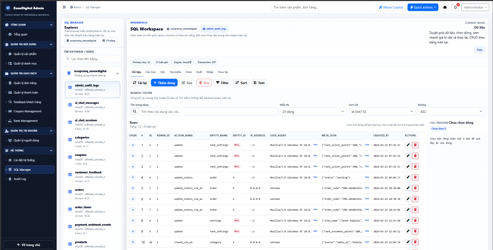

# ZenoxDigital

ZenoxDigital is a cloud-first digital services storefront and backoffice platform built on a custom PHP MVC architecture. The project combines a customer-facing web shop, an operational admin dashboard, wallet and payment flows, and a role-aware AI layer (`Meow`) for both customer support and internal administration.

This repository is intended to serve three purposes at once:

- an academic project that can support reports, presentations, or a capstone-style demonstration
- a technical portfolio project suitable for GitHub, CV, and recruiter review
- a runnable codebase that other developers can inspect, understand, and extend

## Public Repository Update Note

- Last public repository push: `2026-04-21 11:03:27 GMT+07:00`
- Default branch target: `main`

## Overview

ZenoxDigital models an online shop for digital services rather than a generic physical-product marketplace. Its current direction is cloud-first: Cloud VPS and Cloud Server plans are treated as the core product line, while the platform also supports broader digital-service scenarios such as wallet top-up, digital codes, customer feedback, and operational backoffice workflows.

The system is organized around two main surfaces:

- a public storefront for browsing services, managing customer accounts, and completing user-side flows
- an admin dashboard for managing products, orders, users, coupons, payments, feedback, system settings, SQL administration, and AI-assisted operations

## Problem Statement / Project Goal

Many student commerce projects stop at catalog browsing and simple CRUD pages. ZenoxDigital was designed to go beyond that baseline by addressing a broader systems question:

> How can a digital services shop be implemented as both a sales interface and an operational platform, while remaining extensible enough to support security, payment integration, role-based administration, and AI-assisted workflows?

The main goals of the project are:

- build a storefront for digital service discovery and purchase flow
- model key business entities such as products, categories, orders, users, coupons, wallet transactions, feedback, and settings
- provide a usable admin dashboard with role-based access control
- integrate AI as a constrained support layer for customer support and backoffice assistance
- demonstrate software engineering concerns such as session handling, OAuth, 2FA, audit logging, rate limiting, schema health checks, and guarded administrative tooling

## Academic Context / Project Scope

From an academic perspective, ZenoxDigital is not only a “shopping website” project. It is better understood as a small information system for digital-commerce operations.

Its academic value comes from the fact that it covers:

- requirements modeling for multiple actors
- separation between customer-facing and administrator-facing workflows
- data modeling for transactional and support-oriented modules
- role-based access control in a shared codebase
- integration of external services such as Google OAuth and SePay
- AI integration under explicit guardrails instead of unrestricted automation

Because of that scope, the repository can be used for:

- coursework or software engineering reports
- presentation slides and architecture discussion
- final project or personal study demonstration
- portfolio presentation as a full-stack system rather than a UI-only demo

## Deployment Status / Production-like Hosting Setup

ZenoxDigital is not limited to local development. The project has also been deployed to a real hosting environment for operational validation of the main workflows.

The current deployment story can be described accurately as follows:

- the application has been tested on a hosting environment outside local XAMPP-only use
- the deployed setup has been used to validate practical storefront and admin flows
- the hosted environment has been used to validate integration flows such as Google OAuth login and SePay-based wallet top-up / webhook reconciliation
- this README intentionally does **not** publish secrets, private callback tokens, or environment credentials

For public-repository safety, this README avoids hardcoding live secrets or sensitive deployment identifiers. If a public demo URL is approved for disclosure, it can be added later without changing the core technical description.

## Current State Snapshot

The following table is intended to distinguish what is implemented now from what remains future work.

| Area | Current State |
|---|---|
| Storefront | Implemented |
| Admin dashboard | Implemented |
| Product/category/order/user/coupon modules | Implemented |
| Wallet and payment monitoring | Implemented |
| SePay QR + webhook flow | Implemented |
| Google OAuth login | Implemented |
| Audit log and SQL Manager | Implemented |
| Customer AI widget | Implemented |
| Admin Meow Copilot | Implemented |
| AI session persistence for admin | Implemented |
| AI profit/capacity analysis | Not complete yet |
| AI phases 6-8 | Roadmap / future work |

## Key Features

### Storefront

- cloud-first homepage and digital service presentation
- product catalog with search, filtering, sorting, and pagination
- product detail pages with specifications and related offerings
- user registration, login, profile editing, wallet area, and order history
- Google OAuth login support
- customer support chatbot (`Meow`) integrated into the public site
- public feedback submission flow, including header-based feedback entry

### Admin Dashboard

- KPI-oriented dashboard for shop operations
- management modules for products, categories, orders, users, coupons, feedback, payments, settings, ranks, audit logs, and SQL Manager
- role-aware backoffice behavior for `admin` and restricted `staff`
- dedicated AI Copilot panel (`Meow Copilot`) inside the dashboard
- SQL Manager with import preflight, error reporting, and schema health safeguards

### Payment and Wallet

- internal wallet balance tracking for users
- wallet transaction ledger
- QR-based wallet top-up flow using SePay
- webhook-driven reconciliation for incoming payment confirmation
- admin-side payment monitoring for customer transactions

### AI / Meow

- customer chatbot for guidance, FAQ, feedback, and basic order/account support
- admin copilot for dashboard summary, operational queries, and guarded mutations
- server-side AI bridge integration with runtime metadata
- role-aware behavior for `guest`, `customer`, `admin`, and `staff`
- session persistence for admin-side conversations

## System Modules

ZenoxDigital currently includes the following business and operational modules:

- **Products**: digital service catalog, pricing, descriptions, specs, media
- **Categories**: storefront organization and cloud-first grouping
- **Orders**: order lifecycle, status updates, order-item relationships
- **Users**: authentication, role assignment, profile, security, status
- **Coupons**: discount and promotion control
- **Customer Feedback**: public and AI-assisted feedback capture
- **Wallet Transactions**: deposit, spend, refund, and adjustment records
- **Payments**: wallet top-up monitoring, payment snapshots, SePay callback handling
- **Settings**: branding, Google OAuth, SePay, SMTP, and system toggles
- **Audit Log**: administrative traceability
- **SQL Manager**: guarded SQL inspection and import tooling
- **AI Services**: bridge, context builder, actor resolver, guardrails, session services, recommendation logic, and admin mutation control

## User Roles

ZenoxDigital currently distinguishes the following actor groups:

| Role | Main Scope |
|---|---|
| Guest | Browse storefront, ask questions, submit feedback, register/login |
| User / Customer | Use storefront, manage account, wallet, orders, and profile |
| Staff | Restricted backoffice access for operational tasks |
| Admin | Full backoffice access, system management, and AI copilot scope |

Role resolution is handled in the backend, and the AI layer also inherits role-aware behavior from server-side context instead of trusting the browser.

## Software Architecture / Project Structure

ZenoxDigital uses a custom PHP MVC structure with a dedicated Service layer for non-trivial workflows.

```text
ZenoxDigital/
├─ app/
│  ├─ Controllers/         # storefront and admin controllers
│  ├─ Core/                # app bootstrap, router, auth, base model/view/controller
│  ├─ Models/              # PDO-backed data models
│  ├─ Services/            # AI, payment, SQL safety, health, domain helpers
│  ├─ Helpers/             # reusable application helper functions
│  └─ Views/               # storefront, auth, profile, admin, partials, layouts
├─ config/                 # routes, config, AI capability catalog
├─ database/               # schema and seed/demo SQL
├─ docs/                   # AI notes, screenshots, presentation materials
├─ public/
│  ├─ assets/              # CSS and JavaScript
│  ├─ images/              # static assets
│  └─ uploads/             # runtime-uploaded media
└─ storage/                # runtime storage
```

### Architectural notes

- routing is defined in [`config/routes.php`](config/routes.php)
- application configuration is centralized in [`config/config.php`](config/config.php)
- database access is built around PDO and prepared statements
- the admin dashboard and storefront share one codebase but expose different surfaces
- heavy business logic is moved into Services where appropriate rather than being left in controllers
- AI is implemented as server-side services such as:
  - `AiBridgeService`
  - `AiContextBuilder`
  - `AiGuardService`
  - `AiActorResolver`
  - `AdminAiSessionService`
  - `AdminAiProgressService`
  - `AdminAiMutationService`
  - `AiSalesRecommendationService`

## Tech Stack

| Layer | Technology |
|---|---|
| Backend | PHP 8.x |
| Application style | Custom PHP MVC + Services |
| Database | MySQL / MariaDB |
| Data access | PDO prepared statements |
| Frontend | HTML, Bootstrap 5, vanilla JavaScript |
| Authentication | Session auth + Google OAuth |
| Payment | Wallet transaction system + SePay integration |
| Security | CSRF, rate limiting, session tracking, 2FA, audit logging |
| AI | External bridge integration with server-side guardrails |

## AI / Meow Copilot

ZenoxDigital includes a real AI subsystem, not only a static chatbot widget. The AI layer is still intentionally scoped, but it is already meaningful and data-aware.

### Implemented AI capabilities

- public customer chatbot on the storefront
- feedback capture and post-purchase support flow
- order/account assistance using real data
- admin Meow Copilot inside the dashboard
- role-aware prompts and behavior based on backend auth/session state
- admin chat session persistence across reloads
- guarded admin mutation flow:
  - `preview`
  - `confirm`
  - `execute`
  - `audit`

### AI architecture in practice

The AI layer is organized into separate backend services rather than one monolithic controller:

- **context services**: build customer or admin context from current shop data
- **guard services**: block unsafe or unsupported behavior
- **session services**: keep admin conversation continuity
- **progress services**: provide UI progress state during admin requests
- **mutation services**: control preview/confirm/execute paths
- **recommendation services**: provide early-stage product and promotion suggestions

### Current AI maturity

The AI implementation status documented in [`docs/AI_IMPLEMENTATION_STATUS.md`](docs/AI_IMPLEMENTATION_STATUS.md) and [`docs/AI_FEATURE_PHASES_CHECKLIST.md`](docs/AI_FEATURE_PHASES_CHECKLIST.md) indicates:

- Phase 0 to Phase 5 are already implemented
- customer support chat, feedback, order/account support, admin copilot, and preliminary sales recommendation are available
- Phase 6 to Phase 8 remain future work because the schema still lacks some fields required for deeper profit/capacity reasoning

That means the AI system is substantial, but it is **not** being overstated as a fully autonomous business-management agent.

## Payment and External Integrations

### SePay integration

ZenoxDigital includes a real payment integration pattern around SePay for wallet top-up flows.

The implemented design includes:

- SePay QR generation for wallet top-up
- a dedicated webhook endpoint for transaction callbacks
- transaction-code-based reconciliation
- wallet balance updates after verified incoming transfers
- payment monitoring from the admin side through the payment management screen

In architectural terms, the flow is:

1. the user creates a top-up request
2. the system generates a short transaction code and SePay-compatible QR
3. SePay posts an incoming callback to the webhook endpoint
4. the application reconciles the transaction and credits the wallet
5. the admin dashboard can review wallet/payment activity

### Google OAuth integration

The authentication layer supports Google OAuth login in addition to standard email/password authentication.

The implementation includes:

- Google OAuth redirect and callback routes
- configuration via environment/admin settings
- backend handling of profile data returned from Google
- safe default handling when optional profile fields are not available

No secret keys or production credentials are published in this README.

## Security and Access Control

Security and governance are important parts of this repository.

Implemented mechanisms include:

- session-based authentication
- role-aware access control for admin and staff scopes
- Google OAuth login support
- TOTP-based 2FA flows
- backup codes for 2FA recovery
- tracked user sessions and login activities
- CSRF protection on state-changing actions
- rate limiting for login, profile-sensitive flows, public feedback, and AI endpoints
- admin audit logging
- SQL import safeguards and schema health checks
- module-level health guards to isolate broken modules safely

## Installation / Run Locally

### Requirements

- PHP 8.x
- MySQL or MariaDB
- Apache with `mod_rewrite`
- XAMPP, Laragon, or an equivalent PHP hosting stack
- optional: an AI bridge service if you want to enable Meow runtime locally

### 1. Clone the repository

```bash
git clone https://github.com/EmBeHocCode/ZenoDigital.git
cd ZenoDigital
```

### 2. Create the environment file

Copy `.env.example` to `.env`, then configure at least:

- `APP_URL`
- `DB_HOST`
- `DB_PORT`
- `DB_NAME`
- `DB_USER`
- `DB_PASS`
- `UPLOAD_PATH`

Do not place real production secrets into a public repository.

### 3. Import the database

Import the baseline schema:

- [`database/schema.sql`](database/schema.sql)

Optional:

- [`database/demo_dashboard_seed.sql`](database/demo_dashboard_seed.sql) for richer presentation/demo data if you want more activity in charts and KPI summaries

### 4. Configure optional external integrations

#### Google OAuth

Set values such as:

```env
GOOGLE_OAUTH_ENABLED=false
GOOGLE_CLIENT_ID=""
GOOGLE_CLIENT_SECRET=""
GOOGLE_REDIRECT_URI="https://your-domain.com/auth/google/callback"
```

#### AI bridge

If you want to run Meow locally with the bridge enabled:

```env
AI_ENABLED=true
AI_PROVIDER=bridge
AI_BRIDGE_URL="http://your-ai-bridge/api/web-chat"
AI_BRIDGE_KEY="your-secret-key"
AI_CHAT_TIMEOUT=20
AI_BRIDGE_RETRIES=1
AI_BRIDGE_ALLOW_LOCAL_FALLBACK=true
```

#### SePay

SePay-related settings are managed through the application settings layer. For local or hosted setup, prepare:

- bank name / bank code
- bank account number
- account owner name
- SePay enable flag
- webhook token

The README deliberately uses placeholders only.

### 5. Run the application

Point your web server to the `public` entry point, then open:

```text
http://localhost/ZenoxDigital/public
```

## Demo Flow / Main Use Cases

### Storefront flow

1. Open the homepage and inspect the cloud-first storefront positioning.
2. Browse products and filter Cloud VPS / Cloud Server plans.
3. Open a product detail page and inspect specifications.
4. Register or sign in.
5. Explore the profile area, wallet, order history, and security center.
6. Use Meow to ask product or account-related questions.
7. Submit feedback from the AI widget or the public header feedback entry.

### Admin flow

1. Sign in with an account that has backoffice access.
2. Open `/admin` to inspect dashboard KPIs.
3. Visit products, orders, users, coupons, feedback, payments, audit logs, and SQL Manager.
4. Open Meow Copilot and ask operational questions.
5. Review how AI-admin mutations use preview/confirm rather than unrestricted free-form writes.

## Screenshots

The repository now includes real screenshots captured from the current application state.

### Current screenshot assets

- **Storefront homepage**

  

- **Admin dashboard overview**

  

- **Meow Copilot in admin dashboard**

  

- **SQL Manager workbench**

  

## Technical Highlights / What This Project Demonstrates

### For academic evaluation

- a multi-actor information system rather than a single-surface storefront
- explicit separation of customer-side and administrator-side requirements
- data modeling for users, orders, wallets, coupons, feedback, and operational settings
- external-service integration as part of the software architecture
- AI integrated into business workflows with guardrails and permissions

### For recruiters / portfolio review

- a non-trivial PHP MVC application with storefront + backoffice scope
- role-based access control for `user`, `staff`, and `admin`
- payment and wallet workflows beyond simple CRUD
- Google OAuth and SePay webhook integration
- session-aware AI for both customer support and admin assistance
- operational modules such as audit logs and SQL Manager, which make the project look like a real internal toolset

### For other developers

- a readable project structure with Models, Controllers, Services, and Views
- environment-based configuration
- explicit routing and backend-controlled permissions
- a clear boundary between current implementation and future roadmap

## Current Limitations

The current repository has real breadth, but it also has explicit limitations that should be stated honestly.

- it should not be described as a fully enterprise-hardened production platform
- some AI-admin actions are intentionally preview-only or read-only by design
- deeper AI analysis for profit and capacity is not complete because the current schema still lacks fields such as:
  - `cost_price`
  - `stock_qty`
  - `capacity_limit`
  - `capacity_used`
  - `min_margin_percent`
- the AI layer depends on an external bridge service when enabled
- there is no complete automated CI/test pipeline in the public repository yet
- deployment exists in practice, but public deployment metadata is intentionally limited here for safety

## Future Improvements / Roadmap

### Product and platform

- deepen payment and wallet operational visibility
- continue refining storefront presentation and cloud-first merchandising
- improve reporting and operational summaries in the dashboard

### AI roadmap

- **Phase 6**: slow-moving product and capacity analysis
- **Phase 7**: cost-aware profit guardrails
- **Phase 8**: executive reporting and action-plan style admin output

### Engineering roadmap

- add automated tests for critical modules
- add CI/static checks for public-repo readiness
- improve deployment documentation for collaborators
- replace placeholder screenshot assets with real captures

## License

This project is licensed under the MIT License. See [`LICENSE`](LICENSE).
