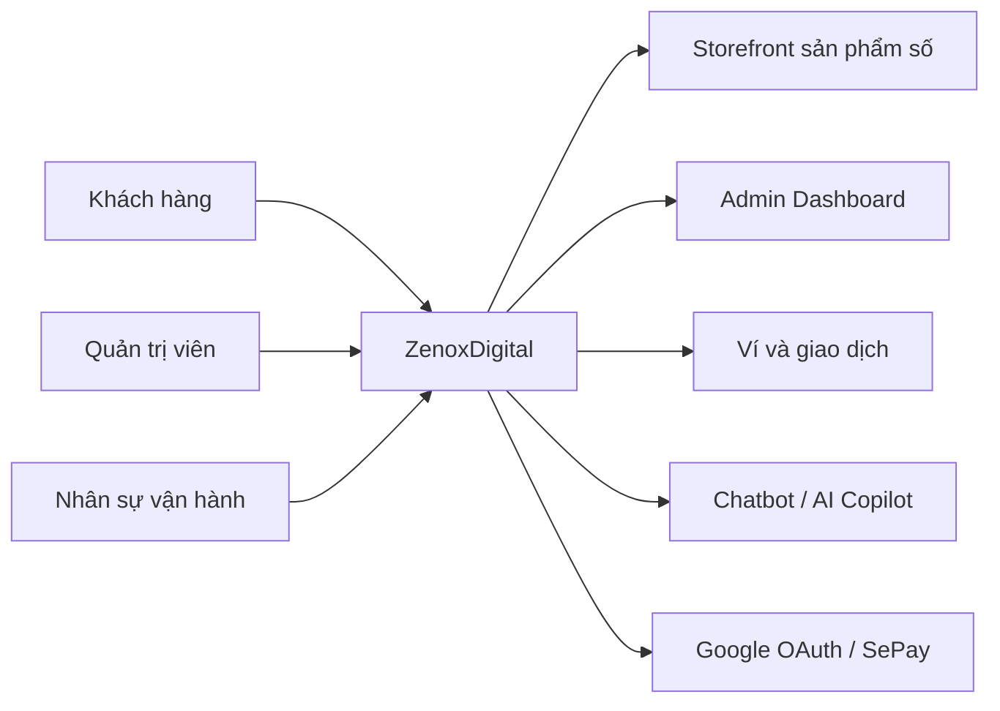
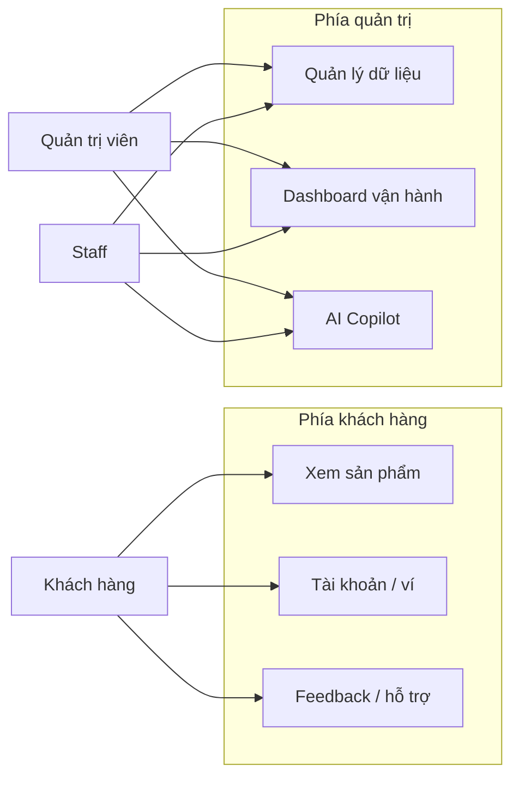
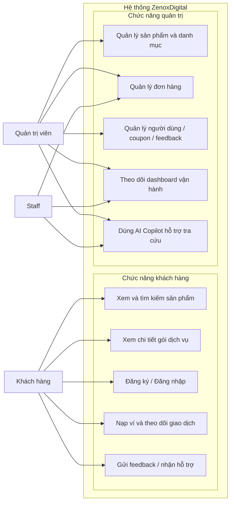
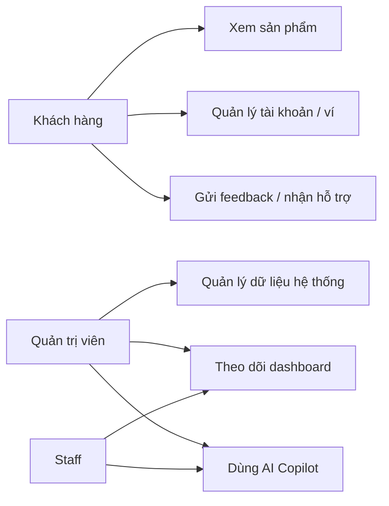
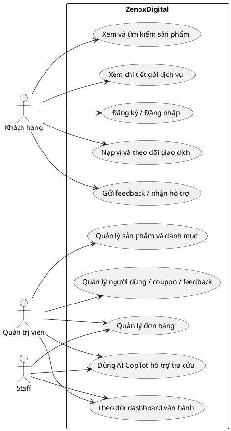

# PRESENTATION_B1_WEEK5

## Mục tiêu buổi 1

Buổi thuyết trình đầu tiên của nhóm tập trung vào hai nội dung chính:

- `Planning`: xác định mục tiêu dự án, đối tượng sử dụng, phạm vi hệ thống và định hướng phát triển ban đầu.
- `Software Requirements Specification (SRS)`: mô tả actor chính, yêu cầu chức năng và yêu cầu phi chức năng ở mức nền tảng.
- Giới thiệu ngắn vai trò của `AI` như một phân hệ hỗ trợ trong hệ thống.

Mục tiêu của buổi này không phải đi sâu vào kỹ thuật triển khai, mà là tạo một khung nhận thức rõ ràng để nối tiếp sang:

- `B2`: Software Architecture Specification
- `B3`: Implementation and Evaluation

---

## Đề xuất cấu trúc slide cho B1

Số lượng đề xuất: `5 slide`

1. Giới thiệu đề tài và bối cảnh dự án
2. Planning: mục tiêu, đối tượng sử dụng, phạm vi
3. Planning: phân hệ lớn và định hướng phát triển
4. SRS: actor và yêu cầu chức năng chính
5. SRS: yêu cầu phi chức năng, vai trò AI Copilot và chuyển tiếp sang B2

---

## Slide 1. Giới thiệu đề tài và bối cảnh dự án

### Nội dung đặt lên slide

**ZenoxDigital**

- Web shop dịch vụ số theo định hướng `cloud-first`
- Tập trung vào nhóm `Cloud VPS / Cloud Server`
- Có `storefront` cho khách hàng và `admin dashboard` cho quản trị
- Có tích hợp và định hướng phát triển `AI Copilot` hỗ trợ vận hành và tư vấn
- Dự án được phát triển theo hướng phục vụ cả học thuật và thực tiễn

### Lời nói ngắn cho slide

Ở buổi đầu, em xin giới thiệu đề tài ZenoxDigital như một hệ thống web shop dịch vụ số, trong đó trọng tâm là các gói Cloud VPS và Cloud Server. Dự án không chỉ có giao diện bán hàng cho khách mà còn có khu vực quản trị để quản lý sản phẩm, đơn hàng, người dùng và các dữ liệu vận hành. Ngoài ra, hệ thống còn có định hướng AI rõ ràng, gồm chatbot hỗ trợ khách hàng và AI Copilot hỗ trợ quản trị. Tuy nhiên ở buổi này nhóm chỉ giới thiệu AI ở mức tổng quan để giữ đúng trọng tâm của planning và requirements, các tính năng sâu xa hơn về bot AI em sẽ trình bày vào 2 buổi thuyết trình tiếp theo.

---

## Slide 2. Planning: mục tiêu, đối tượng sử dụng, phạm vi

### Nội dung đặt lên slide

**Mục tiêu dự án**

- Xây dựng web shop dịch vụ số có cấu trúc tương đối đầy đủ
- Định vị mảng kinh doanh chính là `Cloud VPS / Cloud Server`
- Hỗ trợ cả mua hàng, quản trị và theo dõi vận hành, đưa ra những gợi ý để giúp shop kinh doanh tốt hơn.

**Đối tượng sử dụng**

- Khách hàng mua dịch vụ số
- Quản trị viên và nhân sự vận hành

**Phạm vi hệ thống**

- Hiển thị và bán sản phẩm số
- Quản lý tài khoản, ví và lịch sử giao dịch
- Quản trị dữ liệu nghiệp vụ trong dashboard

### Lời nói ngắn cho slide

Ở góc độ planning, em xác định mục tiêu của ZenoxDigital là xây dựng một hệ thống web shop tương đối hoàn chỉnh, thay vì chỉ làm một giao diện giới thiệu sản phẩm. Đối tượng sử dụng chính gồm hai nhóm là khách hàng và quản trị viên. Phạm vi của hệ thống bao gồm phần storefront cho khách truy cập, phần tài khoản người dùng, và phần dashboard để xử lý các nghiệp vụ như sản phẩm, đơn hàng, thanh toán và các dữ liệu liên quan. Em cũng xác định rất rõ định vị của dự án là cloud-first, nên trọng tâm nội dung và sản phẩm sẽ ưu tiên cho nhóm Cloud VPS và Cloud Server.

---

## Slide 3. Planning: phân hệ lớn và định hướng phát triển

### Nội dung đặt lên slide

**Các phân hệ lớn**

- Storefront: trang chủ, danh sách sản phẩm, chi tiết sản phẩm
- Tài khoản khách hàng: đăng nhập, hồ sơ, ví, lịch sử mua hàng
- Quản trị hệ thống: sản phẩm, danh mục, đơn hàng, người dùng, coupon, feedback
- Hỗ trợ vận hành: dashboard tổng quan, thanh toán, chatbot hỗ trợ và AI Copilot Dashboard

**Định hướng phát triển ban đầu**

- Lấy `Cloud/VPS` làm trục chính của storefront
- Tách rõ phần khách hàng và phần quản trị
- Xây nền để buổi sau đi vào kiến trúc và buổi cuối trình bày triển khai thực tế

### Lời nói ngắn cho slide

Từ phạm vi hệ thống, em chia dự án thành một số phân hệ lớn. Phía người dùng có storefront, tài khoản cá nhân, ví và lịch sử giao dịch. Phía quản trị có dashboard, quản lý sản phẩm, đơn hàng, danh mục, người dùng, coupon và feedback. Ngoài ra, dự án có thêm lớp hỗ trợ thông minh gồm chatbot cho khách hàng và AI Copilot cho quản trị viên. Ở buổi 1, em chỉ dừng ở việc xác định các phân hệ chính và định hướng ban đầu, để buổi 2 có thể đặc tả kiến trúc của từng phần rõ hơn.

---

## Slide 4. SRS: actor và yêu cầu chức năng chính

### Nội dung đặt lên slide

**Actor chính**

- Khách truy cập / khách hàng
- Quản trị viên
- Nhân sự vận hành / staff

**Yêu cầu chức năng phía khách hàng**

- Xem và tìm kiếm sản phẩm
- Xem chi tiết gói dịch vụ
- Đăng ký, đăng nhập, quản lý hồ sơ
- Nạp ví và theo dõi lịch sử giao dịch
- Gửi feedback và nhận hỗ trợ

**Yêu cầu chức năng phía quản trị**

- Quản lý sản phẩm và danh mục
- Quản lý đơn hàng và trạng thái xử lý
- Quản lý người dùng, coupon, feedback
- Theo dõi dashboard vận hành

### Lời nói ngắn cho slide

Phần Software Requirements Specification trước hết cần xác định actor. Trong dự án này, em chia actor thành khách truy cập hoặc khách hàng, quản trị viên và nhân sự vận hành. Từ đó, em xác định các yêu cầu chức năng chính. Phía khách hàng sẽ tập trung vào các tác vụ như xem sản phẩm, quản lý tài khoản, nạp ví, theo dõi giao dịch và nhận hỗ trợ. Phía quản trị sẽ tập trung vào các tác vụ quản lý dữ liệu và vận hành hệ thống, như sản phẩm, danh mục, đơn hàng, người dùng, coupon và feedback. Ở buổi này em chỉ trình bày ở mức chức năng chính, chưa đi sâu vào luồng xử lý chi tiết.

---

## Slide 5. SRS: yêu cầu phi chức năng, vai trò AI Copilot và chuyển tiếp

### Nội dung đặt lên slide

**Yêu cầu phi chức năng chính**

- Giao diện dễ dùng cho cả khách hàng và quản trị viên
- Dữ liệu nghiệp vụ phải nhất quán và an toàn
- Hệ thống có khả năng mở rộng thêm module
- Phân quyền rõ giữa người dùng và quản trị
- Phản hồi ở mức chấp nhận được cho tác vụ chính

**Vai trò AI Copilot**

- Chatbot hỗ trợ khách hàng hỏi đáp, tra cứu và nhận hỗ trợ ban đầu
- AI Copilot hỗ trợ admin tra cứu dữ liệu, theo dõi vận hành và gợi ý xử lý
- Không thay thế hoàn toàn logic nghiệp vụ cốt lõi
- Được giới thiệu ở mức tổng quan, chi tiết kỹ thuật sẽ để cho các buổi sau

**Chuyển tiếp sang buổi 2**

- Từ planning và requirements, em sẽ đặc tả kiến trúc phần mềm
- Buổi sau tập trung vào module, lớp xử lý và cách tổ chức hệ thống

### Lời nói ngắn cho slide

Ngoài yêu cầu chức năng, nhóm cũng xác định một số yêu cầu phi chức năng quan trọng như khả năng sử dụng, tính nhất quán dữ liệu, phân quyền, khả năng mở rộng và hiệu năng ở mức phù hợp. Bên cạnh đó, AI trong hệ thống được giới thiệu như một thành phần hỗ trợ gồm chatbot cho khách hàng và AI Copilot cho quản trị, chứ không thay thế hoàn toàn nghiệp vụ chính. Điều này giúp dự án có hướng phát triển rõ ràng hơn mà vẫn giữ tính khả thi. Sau khi đã xác định planning và yêu cầu phần mềm ở buổi 1, nhóm sẽ chuyển sang buổi 2 để trình bày Software Architecture Specification, tức là cách các module và thành phần của hệ thống được tổ chức ở mức kiến trúc.

---

## Đoạn chuyển tiếp cuối sang buổi 2

Tóm lại, buổi 1 giúp nhóm xác định rõ mục tiêu, phạm vi, actor, các yêu cầu nền tảng và vai trò tổng quan của AI trong ZenoxDigital. Từ cơ sở này, ở buổi thuyết trình tiếp theo, nhóm sẽ đi vào `Software Architecture Specification`, tức là mô tả cách hệ thống được phân lớp, cách các module tương tác với nhau và cách tích hợp AI theo kiến trúc phù hợp với một web shop dịch vụ số theo định hướng cloud-first.

---

## Sơ đồ gợi ý cho B1

Đối với buổi 1, nên dùng tối đa `2 sơ đồ` để vừa học thuật vừa gọn:

- `Sơ đồ ngữ cảnh (Context Diagram)`
- `Sơ đồ Use Case` ở mức khái quát

### 1. Code sơ đồ ngữ cảnh bằng Mermaid

### Gợi ý nói khi chiếu sơ đồ ngữ cảnh

Sơ đồ này cho thấy ZenoxDigital là hệ thống trung tâm, tương tác với ba nhóm người dùng chính là khách hàng, quản trị viên và nhân sự vận hành. Bên trong hệ thống có các phần quan trọng như storefront, dashboard quản trị, ví giao dịch và lớp hỗ trợ AI. Ngoài ra hệ thống còn kết nối với một số dịch vụ ngoài như Google OAuth và SePay.

### 2. Code sơ đồ Use Case bằng Mermaid

### Bản khuyên dùng cho slide ngang 16:9

Đây là bản nên dùng khi đưa vào PowerPoint, vì bố cục ngang và số lượng khối vừa đủ để dễ nhìn từ xa:

### Gợi ý nói khi chiếu bản nằm ngang

Nếu cần thuyết trình ngắn, anh có thể gom toàn bộ chức năng thành hai cụm chính là phía khách hàng và phía quản trị. Cách trình bày này vẫn giữ được actor và nghiệp vụ cốt lõi, nhưng giúp sơ đồ nằm ngang, dễ nhìn và phù hợp với slide 16:9 hơn. AI Copilot được đặt ở cụm quản trị để thể hiện đúng vai trò hỗ trợ vận hành trong hệ thống.

### Bản đầy đủ hơn nếu có slide riêng cho requirements

### Gợi ý nói khi chiếu sơ đồ Use Case

Sơ đồ Use Case giúp nhóm tóm tắt yêu cầu chức năng ở mức cao. Khách hàng chủ yếu tương tác với các chức năng mua và sử dụng dịch vụ, còn quản trị viên và staff tập trung vào các chức năng vận hành hệ thống. AI Copilot được thể hiện như một chức năng hỗ trợ thêm, thay vì là trung tâm của toàn bộ hệ thống.

### Bản rút gọn hơn cho slide ngang 16:9

Nếu vẫn thấy chật khi đưa vào PowerPoint hoặc muốn nói rất ngắn, anh có thể dùng bản rút gọn này:

### Gợi ý dùng trên slide

- Nếu chỉ có một slide cho requirements: dùng `bản khuyên dùng cho slide ngang 16:9`
- Nếu slide còn nhiều chữ: dùng `bản rút gọn`
- Nếu có hẳn một slide riêng cho Use Case: dùng `bản đầy đủ`
- Trong PowerPoint widescreen, nên để sơ đồ chiếm nửa trái hoặc giữa slide, phần phải để 3-4 bullet giải thích ngắn

### 3. Nếu muốn vẽ đúng kiểu Use Case UML hơn

Anh có thể dùng code PlantUML sau:

### Web gợi ý để vẽ sơ đồ

- Mermaid Live Editor: [https://mermaid.live](https://mermaid.live)
  - Phù hợp nếu muốn copy code Mermaid và xuất nhanh PNG/SVG.
- draw.io / diagrams.net: [https://app.diagrams.net](https://app.diagrams.net)
  - Phù hợp nếu muốn kéo thả thủ công trên slide hoặc làm đẹp lại sơ đồ.
- PlantText: [https://www.planttext.com](https://www.planttext.com)
  - Phù hợp nếu muốn vẽ Use Case đúng phong cách UML bằng code PlantUML.

### Khuyến nghị thực tế

- Nếu cần nhanh: dùng `Mermaid Live Editor`
- Nếu cần đẹp để bỏ vào PowerPoint: dùng `draw.io`
- Nếu giảng viên thích đúng chất UML: dùng `PlantText` với code PlantUML ở trên

---

## Ghi chú sử dụng nhanh

- Nếu cần thuyết trình ngắn: giữ nguyên 5 slide trên.
- Nếu cần rút xuống 4 slide: có thể gộp Slide 2 và Slide 3 thành một slide Planning tổng hợp.
- Nếu cần kéo sang B2 và B3: giữ nguyên thuật ngữ `Planning`, `SRS`, `Architecture`, `Implementation`, `Evaluation` để mạch 3 buổi thống nhất.
